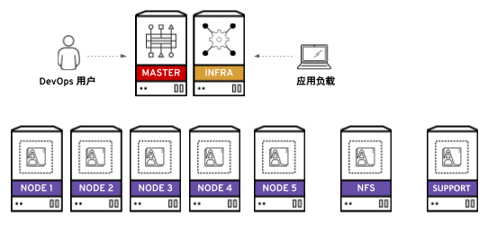
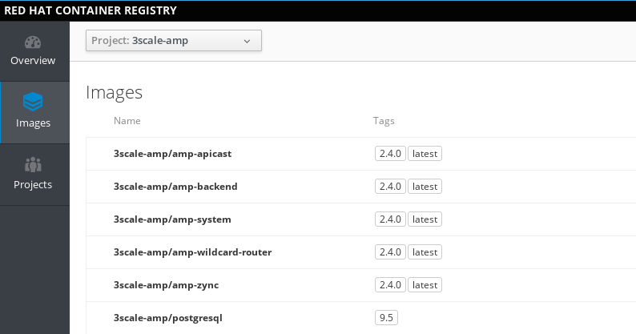
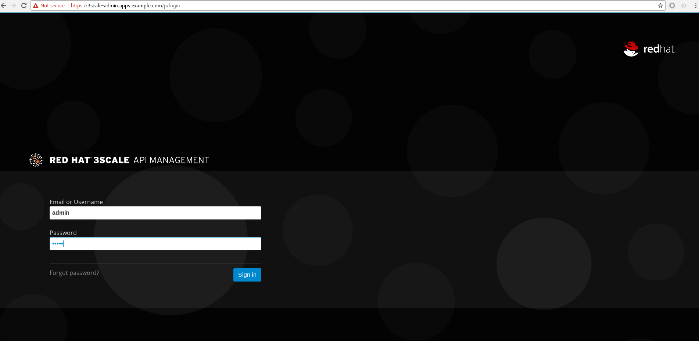

= POC 环境安装说明
:toc: manual

== OpenShift 3.11

OpenShift 容器平台由红帽公司以 RPM 软件包和容器镜像的组合形式交付。RPM 软件包可通过订阅从标准的红帽 YUM 源下载，容器镜像则来自红帽私有容器仓库(https://access.redhat.com/containers/)下载。  

=== 安装架构

OpenShift 容器平台安装需要多台服务器，它们可以是物理机和虚拟机的任意组合。其中一些称为管理节点，一些则为计算节点，还有基础设施节点，如下图为一安装架构图,

=== 详细安装文档

通常，这些不同的节点分别需要不同的软件包和配置。为了方便安装，可以基于 Ansible 进行安装，通过 Ansible Playbook 脚本来自动化相关的安装流程。具体 OpenShift 安装分三个阶段：

link:http://ksoong.org/docs/content/openshift/install/[详细参照此文档]

* 准备安装 - 包括 YUM 源配置，容器镜像下载，相关软件的下载安装，容器镜像下载与本地容器镜像仓库配置等
* 安装 - 执行 Ansible Playbook 脚本安装
* 后续安装 - 安全认证配置，等

=== 详细节点功能说明

详细安装架构说明如下表所示，OpenShift 安装需要 9 台服务器，

[cols="2,2,5a"]
|===
|ip 地址 |域名 |说明

|10.19.40.208
|master.hisense.com
|管理节点

|10.19.40.209
|infra.hisense.com
|基础设施节点

* 内部镜像仓库
* 日志
* 监控
* 路由

|10.19.40.210
|node1.hisense.com
|计算节点

|10.19.40.211
|node2.hisense.com
|计算节点

|10.19.40.212
|node3.hisense.com
|计算节点

|10.19.40.213
|node4.hisense.com
|计算节点

|10.19.40.214
|node5.hisense.com
|计算节点

|10.19.40.215
|nfs.hisense.com
|NFS 服务器

|10.19.40.216
|support.hisense.com
|
* 公共镜像仓库
* yum 源服务器
* DNS 服务器
|===

[source, text]
.*9 台服务器都安装的是 Linux 操作系统*
----
# cat /etc/redhat-release 
Red Hat Enterprise Linux Server release 7.5 (Maipo)
----

== 3Scale 2.4

=== 模版下载

[source, text]
.*1. Enale rhel-7-server-3scale-amp-2.4-rpms*
----
# subscription-manager list --available --matches '*3scale*'
# subscription-manager attach --pool=<PoolID>
# subscription-manager repos --enable=rhel-7-server-3scale-amp-2.4-rpms
----

[source, text]
.*2. 获取模版*
----
# yum install 3scale-amp-template
----

[source, text]
.*3. 列出所有模版*
----
# rpm -q -l 3scale-amp-template
/opt/amp/templates
/opt/amp/templates/amp-eval-tech-preview.yml
/opt/amp/templates/amp-ha-tech-preview.yml
/opt/amp/templates/amp-s3.yml
/opt/amp/templates/amp.yml
----

=== 安装准备

*1. 确保 OpenShift 安装并正常运行.*

*2. 下载*

* (Option 1) 参照 *模版下载*

* (Option 2) 下载 3Scale 2.4 - https://github.com/3scale/3scale-amp-openshift-templates/tree/2.4.0.GA/amp

[source, bash]
----
wget https://raw.githubusercontent.com/3scale/3scale-amp-openshift-templates/2.4.0.GA/amp/amp.yml
----

*3. 创建 4 个 PV*

|===
|类型 |描述

|RWO
|redis backend, 1Gi

|RWO
|redis system, 1Gi

|RWO
|mysql, 1Gi

|RWX
|system, 100Mi
|===

NFS 服务器创建 exporter:

[source, text]
----
mkdir -p /srv/nfs/3scale/pv{1..4}

for pvnum in {1..4} ; do
echo "/srv/nfs/3scale/pv${pvnum} *(rw,root_squash)" >> /etc/exports.d/openshift-3scale.exports
chown -R nfsnobody.nfsnobody  /srv/nfs/3scale/pv${pvnum}
chmod -R 777 /srv/nfs
done

systemctl restart nfs-server
----

创建 3scale-24-mysql PV 的 yaml 文件：

[source, yaml]
----
{
  "apiVersion": "v1",
  "kind": "PersistentVolume",
  "metadata": {
    "name": "pv1"
  },
  "spec": {
    "capacity": {
        "storage": "1Gi"
    },
    "accessModes": [ "ReadWriteOnce" ],
    "nfs": {
        "path": "/srv/nfs/3scale/pv1",
        "server": "nfs.hisense.com"
    },
    "persistentVolumeReclaimPolicy": "Recycle"
  }
}
----

创建 3scale-24-redis-backend PV 的 yaml 文件:

[source, yaml]
----
{
  "apiVersion": "v1",
  "kind": "PersistentVolume",
  "metadata": {
    "name": "pv2"
  },
  "spec": {
    "capacity": {
        "storage": "1Gi"
    },
    "accessModes": [ "ReadWriteOnce" ],
    "nfs": {
        "path": "/srv/nfs/3scale/pv2",
        "server": "nfs.hisense.com"
    },
    "persistentVolumeReclaimPolicy": "Recycle"
  }
}
----

创建 3scale-24-redis-system PV 的 yaml 文件:

[source, text]
----
{
  "apiVersion": "v1",
  "kind": "PersistentVolume",
  "metadata": {
    "name": "pv3"
  },
  "spec": {
    "capacity": {
        "storage": "1Gi"
    },
    "accessModes": [ "ReadWriteOnce" ],
    "nfs": {
        "path": "/srv/nfs/3scale/pv3",
        "server": "nfs.hisense.com"
    },
    "persistentVolumeReclaimPolicy": "Recycle"
  }
}
----

创建 3scale-24-system PV 的 yaml 文件:

[source, text]
----
{
  "apiVersion": "v1",
  "kind": "PersistentVolume",
  "metadata": {
    "name": "pv4"
  },
  "spec": {
    "capacity": {
        "storage": "100Mi"
    },
    "accessModes": [ "ReadWriteMany" ],
    "nfs": {
        "path": "/srv/nfs/3scale/pv4",
        "server": "nfs.hisense.com"
    },
    "persistentVolumeReclaimPolicy": "Retain"
  }
}
----

查克创建的相关 PV

[source, text]
----
# oc get pv | grep pv-3scale-24
pv-3scale-24-mysql           1Gi        RWO            Recycle          Available                   15s
pv-3scale-24-redis-backend   1Gi        RWO            Recycle          Available                   15s
pv-3scale-24-redis-system    1Gi        RWO            Recycle          Available                   15s
pv-3scale-24-system          100Mi      RWX            Retain           Available                   15s
----

[source, bash]
.*4. 下载 3Scale 2.4 所需的容器镜像*
----
registry.access.redhat.com/3scale-amp24/backend
registry.access.redhat.com/3scale-amp24/zync
registry.access.redhat.com/3scale-amp24/apicast-gateway
registry.access.redhat.com/3scale-amp22/wildcard-router
registry.access.redhat.com/3scale-amp24/system
registry.access.redhat.com/rhscl/postgresql-95-rhel7:9.5
registry.access.redhat.com/rhscl/mysql-57-rhel7:5.7
registry.access.redhat.com/3scale-amp20/memcached
registry.access.redhat.com/rhscl/redis-32-rhel7:3.2
----

=== 安装

[source, bash]
.*1 - 创建一个工程*
----
oc new-project 3scale-amp --display-name="3scale APM 2.4" --description="3scale AMP 2.4"
----

[source, text]
.*2 - 根据模版创建容器部署对象*
----
# oc new-app -f amp.yml --param ADMIN_PASSWORD=redhat --param MASTER_PASSWORD=redhat --param WILDCARD_DOMAIN=apps.hisense.com --param WILDCARD_POLICY=Subdomain
--> Deploying template "3scale-amp/3scale-api-management" for "amp.yml" to project 3scale-amp

     3scale API Management
     ---------
     3scale API Management main system

     Login on https://3scale-admin.apps.hisense.com as admin/redhat

     * With parameters:
        * AMP_RELEASE=2.4.0
        * APP_LABEL=3scale-api-management
        * TENANT_NAME=3scale
        * RWX_STORAGE_CLASS=null
        * AMP_BACKEND_IMAGE=registry.hisense.com/3scale-amp24/backend
        * AMP_ZYNC_IMAGE=registry.hisense.com/3scale-amp24/zync
        * AMP_APICAST_IMAGE=registry.hisense.com/3scale-amp24/apicast-gateway
        * AMP_ROUTER_IMAGE=registry.hisense.com/3scale-amp22/wildcard-router
        * AMP_SYSTEM_IMAGE=registry.hisense.com/3scale-amp24/system
        * POSTGRESQL_IMAGE=registry.hisense.com/rhscl/postgresql-95-rhel7:9.5
        * MYSQL_IMAGE=registry.hisense.com/rhscl/mysql-57-rhel7:5.7
        * MEMCACHED_IMAGE=registry.hisense.com/3scale-amp20/memcached
        * IMAGESTREAM_TAG_IMPORT_INSECURE=false
        * REDIS_IMAGE=registry.hisense.com/rhscl/redis-32-rhel7:3.2
        * MySQL User=mysql
        * MySQL Password=ld6lc7js # generated
        * MySQL Database Name=system
        * MySQL Root password.=qv0wq2pg # generated
        * SYSTEM_BACKEND_USERNAME=3scale_api_user
        * SYSTEM_BACKEND_PASSWORD=kxrcwfhd # generated
        * SYSTEM_BACKEND_SHARED_SECRET=sgn2xnkb # generated
        * SYSTEM_APP_SECRET_KEY_BASE=3a41d8786540debe258d4585ec861215c02d181cbb31424864032ae2a1a57867a7381c820eabac878c86a385082136013626edd0276c7c248136653405744c04 # generated
        * ADMIN_PASSWORD=redhat
        * ADMIN_USERNAME=admin
        * ADMIN_ACCESS_TOKEN=7ggqj3ipnl1v4srr # generated
        * MASTER_NAME=master
        * MASTER_USER=master
        * MASTER_PASSWORD=redhat
        * MASTER_ACCESS_TOKEN=1s2gnhr0 # generated
        * RECAPTCHA_PUBLIC_KEY=
        * RECAPTCHA_PRIVATE_KEY=
        * PostgreSQL Connection Password=r3xGXkO24MghV6kf # generated
        * ZYNC_SECRET_KEY_BASE=44bOFigQAFG1RXkK # generated
        * ZYNC_AUTHENTICATION_TOKEN=vp1HtV133TJ3fcjl # generated
        * APICAST_ACCESS_TOKEN=d83s08n5 # generated
        * APICAST_MANAGEMENT_API=status
        * APICAST_OPENSSL_VERIFY=false
        * APICAST_RESPONSE_CODES=true
        * APICAST_REGISTRY_URL=http://apicast-staging:8090/policies
        * WILDCARD_DOMAIN=apps.hisense.com
        * WILDCARD_POLICY=Subdomain

--> Creating resources ...
    imagestream.image.openshift.io "amp-backend" created
    imagestream.image.openshift.io "amp-zync" created
    imagestream.image.openshift.io "amp-apicast" created
    imagestream.image.openshift.io "amp-wildcard-router" created
    imagestream.image.openshift.io "amp-system" created
    imagestream.image.openshift.io "postgresql" created
    deploymentconfig.apps.openshift.io "backend-redis" created
    service "backend-redis" created
    configmap "redis-config" created
    persistentvolumeclaim "backend-redis-storage" created
    deploymentconfig.apps.openshift.io "system-redis" created
    persistentvolumeclaim "system-redis-storage" created
    deploymentconfig.apps.openshift.io "backend-cron" created
    deploymentconfig.apps.openshift.io "backend-listener" created
    service "backend-listener" created
    route.route.openshift.io "backend" created
    deploymentconfig.apps.openshift.io "backend-worker" created
    configmap "backend-environment" created
    secret "backend-internal-api" created
    secret "backend-redis" created
    secret "backend-listener" created
    deploymentconfig.apps.openshift.io "system-mysql" created
    configmap "mysql-main-conf" created
    configmap "mysql-extra-conf" created
    persistentvolumeclaim "mysql-storage" created
    deploymentconfig.apps.openshift.io "system-memcache" created
    persistentvolumeclaim "system-storage" created
    service "system-provider" created
    service "system-master" created
    service "system-developer" created
    route.route.openshift.io "system-provider-admin" created
    route.route.openshift.io "system-master" created
    route.route.openshift.io "system-developer" created
    service "system-mysql" created
    service "system-redis" created
    service "system-sphinx" created
    service "system-memcache" created
    configmap "system" created
    configmap "smtp" created
    configmap "system-environment" created
    deploymentconfig.apps.openshift.io "system-app" created
    deploymentconfig.apps.openshift.io "system-sidekiq" created
    deploymentconfig.apps.openshift.io "system-sphinx" created
    secret "system-events-hook" created
    secret "system-redis" created
    secret "system-master-apicast" created
    secret "system-database" created
    secret "system-seed" created
    secret "system-recaptcha" created
    secret "system-app" created
    secret "system-memcache" created
    deploymentconfig.apps.openshift.io "zync" created
    deploymentconfig.apps.openshift.io "zync-database" created
    service "zync" created
    service "zync-database" created
    secret "zync" created
    deploymentconfig.apps.openshift.io "apicast-staging" created
    deploymentconfig.apps.openshift.io "apicast-production" created
    service "apicast-staging" created
    service "apicast-production" created
    route.route.openshift.io "api-apicast-staging" created
    route.route.openshift.io "api-apicast-production" created
    configmap "apicast-environment" created
    secret "apicast-redis" created
    deploymentconfig.apps.openshift.io "apicast-wildcard-router" created
    service "apicast-wildcard-router" created
    route.route.openshift.io "apicast-wildcard-router" created
--> Success
    Access your application via route 'backend-3scale.apps.hisense.com' 
    Access your application via route '3scale-admin.apps.hisense.com' 
    Access your application via route 'master.apps.hisense.com' 
    Access your application via route '3scale.apps.hisense.com' 
    Access your application via route 'api-3scale-apicast-staging.apps.hisense.com' 
    Access your application via route 'api-3scale-apicast-production.apps.hisense.com' 
    Access your application via route 'apicast-wildcard.apps.hisense.com' 
    Run 'oc status' to view your app.
----

=== 安装验证

[source, text]
.*1. 查看运行的容器*
----
# oc get pods
NAME                              READY     STATUS    RESTARTS   AGE
apicast-production-1-g2lfd        1/1       Running   0          32m
apicast-staging-1-qs9wc           1/1       Running   0          32m
apicast-wildcard-router-1-4q8jl   1/1       Running   0          32m
backend-cron-1-wdqp9              1/1       Running   0          32m
backend-listener-1-j85fg          1/1       Running   0          32m
backend-redis-1-bq7j8             1/1       Running   0          32m
backend-worker-1-l99nc            1/1       Running   0          32m
system-app-1-5vj47                3/3       Running   0          23m
system-memcache-1-kxllm           1/1       Running   0          32m
system-mysql-1-zqlzs              1/1       Running   0          32m
system-redis-1-7crfx              1/1       Running   0          32m
system-sidekiq-1-bwkjf            1/1       Running   0          32m
system-sphinx-1-fxs8k             1/1       Running   0          32m
zync-1-6cqt2                      1/1       Running   0          32m
zync-database-1-sbgcq             1/1       Running   0          32m
----

.*2. 查看容器的镜像*

使用 https://registry-console-default.apps.hisense.com/registry 可以查看内部镜像仓库。

[source, text]
.*3 - 查看创建的 PVC*
----
# oc get pvc
NAME                    STATUS    VOLUME                       CAPACITY   ACCESS MODES   STORAGECLASS   AGE
backend-redis-storage   Bound     pv-3scale-24-redis-system    1Gi        RWO                           44m
mysql-storage           Bound     pv-3scale-24-redis-backend   1Gi        RWO                           44m
system-redis-storage    Bound     pv-3scale-24-mysql           1Gi        RWO                           44m
system-storage          Bound     pv-3scale-24-system          100Mi      RWX                           44m
----

[source, bash]
.*4 - 查看 Mysql 数据库*
----
$ oc rsh $(oc get pod | grep mysql | awk '{print $1}')
$ mysql -uroot system
mysql> show tables;
----

[source, bash]
.*5 - 登录 3Scale 管理界面，执行如下命令获取登录 URL*
----
$ cat /tmp/3scale_amp_provision_details.txt | grep Login
     Login on https://3scale-admin.apps.hisense.com as admin/admin
----

登录 https://3scale-admin.apps.hisense.com 进入到 3Scale 登录界面:

使用 `admin`/`redhat` 即可登录 3Scale API 管理控制台。

== 中台服务安装

具体参照 Case 操作步骤
